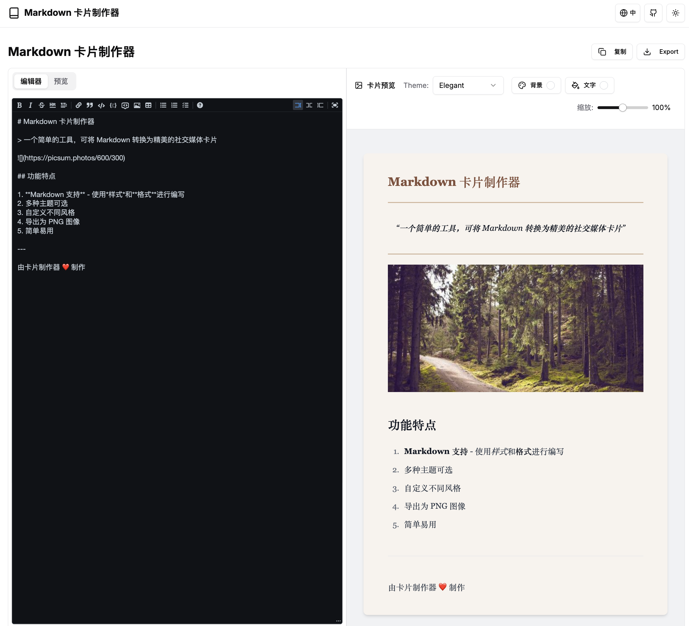

<div align="right">
  [<a href="./README.md">简体中文</a>] | [<a href="./README_EN.md">English</a>] | [日本語]
</div>

# Markdown Card Maker

一个简单而强大的工具，可将 Markdown 转换为精美的社交媒体卡片。支持多种主题、自定义样式和多语言界面。
**可为小红书、Twitter、Instagram 等平台设计的精美卡片生成工具**，支持 15+ 种主题风格，实时预览和一站式导出功能。




## 🔗 在线演示

- [DEMO & WEB Editor](https://md.jingtu-tech.com)

## ✨ 功能特点

- 📝 **完整的 Markdown 支持** - 包括表格、代码块、列表等
- 🎨 **多种主题** - 提供多种预设主题，满足不同场景需求
- 🌈 **自定义样式** - 可自定义背景颜色和文本颜色
- 📱 **响应式设计** - 适配各种设备屏幕
- 🔄 **实时预览** - 编辑时即时查看效果
- 📤 **导出功能** - 支持导出为 PNG 图像
- 🌍 **多语言支持** - 支持英文、中文和日文界面
- 🌓 **暗色模式** - 支持亮色/暗色主题切换

## ✨ 技术亮点
📸 精准截图 - 基于 html-to-image 的高清导出
🎮 交互体验 - 仿 Notion 的实时双栏编辑器

## 🚀 快速开始

### 安装依赖

```bash
# 使用 npm
npm install

# 或使用 yarn
yarn install

# 或使用 pnpm
pnpm install

# 或使用 bun
bun install
```

## 许可证

Apache 2.0开源协议。