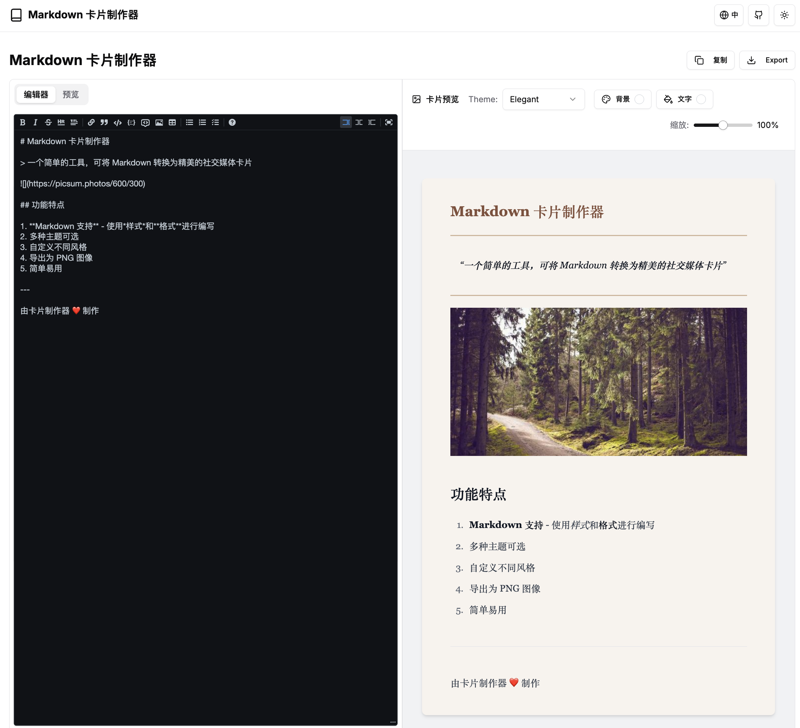
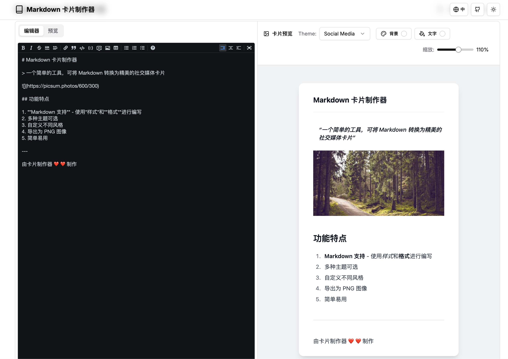

<div align="right">
  [<a href="./README.md">简体中文</a>] | [<a href="./README_JP.md">日本語</a>] | [English]
</div>

# 🎨 Markdown Social Card Maker

**Professional tool for creating beautiful social media cards for Xiaohongshu, Twitter, Instagram, etc.** with 15+ themes and real-time preview.




- [DEMO & Web Editor](https://md.jingtu-tech.com)

## ✨ Key Features

- 📝 **Full Markdown Support** - Tables, code blocks, lists, etc.
- 🎨 **Multiple Themes** - 15+ preset themes for different scenarios
- 🌈 **Custom Styles** - Adjust background/text colors
- 📱 **Responsive Design** - Adapts to all device screens
- 🔄 **Real-time Preview** - Instant editing feedback
- 📤 **Export Function** - Save as PNG images
- 🌍 **Multi-language UI** - English/Chinese/Japanese
- 🌓 **Dark Mode** - Light/Dark theme switching

## ✨ Technical Highlights
📸 High-quality export based on html-to-image  
🎮 Notion-style dual-pane editor

## 🚀 Getting Started

### Install Dependencies

```bash
# Using npm
npm install

# Using yarn
yarn install

# Using pnpm
pnpm install

# Using bun
bun install